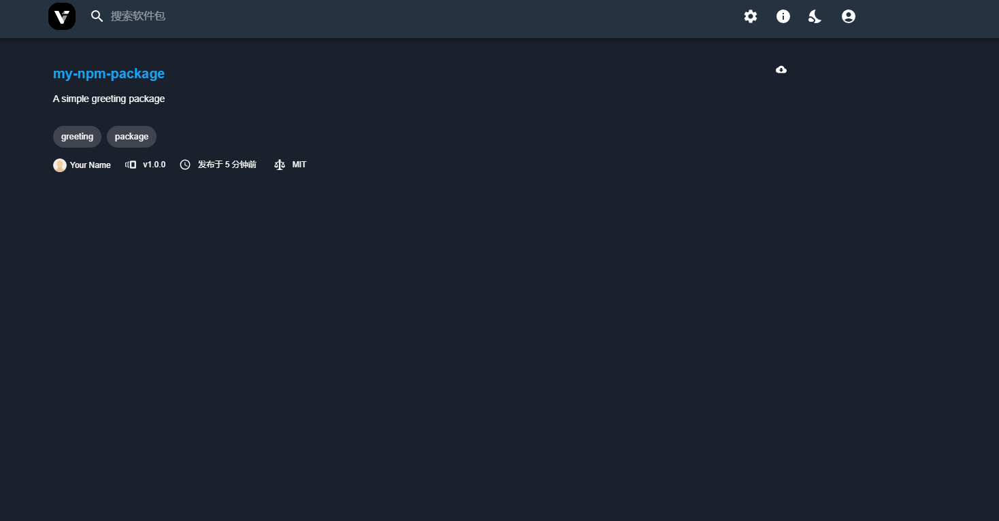

npm私服：

### 使用verdaccio
- **verdaccio**：是一个轻量级的、易于搭建和配置的npm私服工具，它支持多种存储方式，并且有友好的Web界面，方便管理和查看包的信息。

### 安装与配置
verdaccio：
- **安装**：确保已经安装了Node.js和npm，在命令行中执行`npm install -g verdaccio`即可全局安装verdaccio。
- **配置**：安装完成后，在命令行中执行`verdaccio`，它会在默认目录下生成配置文件`config.yaml`。可根据需求进行修改，比如修改存储路径、添加用户认证等。以下是一个简单的配置示例：
```yaml
storage:./storage  # 包存储路径
auth:
  htpasswd:
    file:./htpasswd  # 用户认证文件路径
uplinks:
  npmjs:
    url: https://registry.npmjs.org/  # 上游npm仓库地址
packages:
  '@*/*':
    access: $all
    publish: $authenticated
    proxy: npmjs
  '**':
    access: $all
    publish: $authenticated
    proxy: npmjs
```
- **启动服务**：在命令行中执行`verdaccio`，即可启动私服服务。默认情况下，verdaccio会监听在`http://localhost:4873`。

### 客户端配置
- **配置npm源**：在项目的根目录下，执行`npm config set registry http://localhost:4873`，将npm源指向私服地址。也可以通过修改`.npmrc`文件来配置，在文件中添加`registry=http://localhost:4873`。
- **添加用户**：执行`npm adduser --registry http://localhost:4873`，按照提示输入用户名、密码和邮箱，即可在私服中添加用户。
- **发布包**：在项目目录下，执行`npm publish --registry http://localhost:4873`，即可将本地的npm包发布到私服上。
- **安装包**：执行`npm install [package name] --registry http://localhost:4873`，可以从私服安装所需的包。



- **details**
https://verdaccio.org/zh-cn/docs/cli-registry/